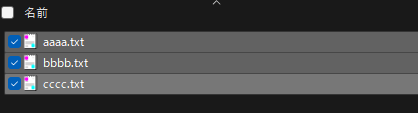
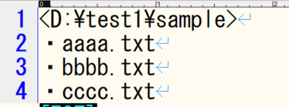

# ClipFilePath
右クリックメニューの「送る」でファイルパスをクリップボードにコピーするWindows専用ソフト

## 使用方法
1. 送るメニューに「ClipFilePath」を追加する
    - Win+R で「ファイル名を指定して実行」で```shell sendto```を実行しSendToフォルダを開く
    - SendToフォルダに「ClipFilePath.exe」をコピーする(ショートカットでも可)
2. ClipFilePathでファイルパスをコピーする
    - 対象のファイルを選択する<br>
      
    - 右クリックメニューの「送る」で ClipFilePath.exeを選択する<br>
      
    - テキストに貼り付ける<br>
      

## ファイルパスのフォーマットについて

選択したファイルへのパスを<>で囲む形式<br>
選択したファイルは先頭に・をつけて名前順にソートしてパスの下に並ぶ形式でクリップボードにコピーする

【Tips】<br>
 フォルダを選択しても上記フォーマットでコピー可能です

例)
```
<D:\test1\sample>
・aaaa.txt
・bbbb.txt
・cccc.txt
```

## build手順

【build環境】
|ツール           |Version       |説明                               |
|:---             |:----         |:----                              |
|CMake(cmake-gui) | ver14.0      |マルチプラットフォームビルドツール |
|VisualStudio     | 2017 - 2022  |統合開発環境(C++ビルドツール)      |

【build手順】
1. git hubから「ClipFilePath」をダウンロード(クローン)する<br>
   ※とりあえず実行ファイル(ClipFilePath.exe)を置いているのでビルドせずに使用することも可能
2. ClipFilePathフォルダに移動しbuildフォルダを作成する
3. buildフォルダを指定してCMakeを実行
4. Visual Studioでビルドする

### 開発背景
チャット等でファイルパスのみの情報共有が多く、<br>
デフォルトの右クリックメニューの「パスのコピー」のフォーマットが気に入らないのと<br>
複数選択できないのを解消したかった！！！

